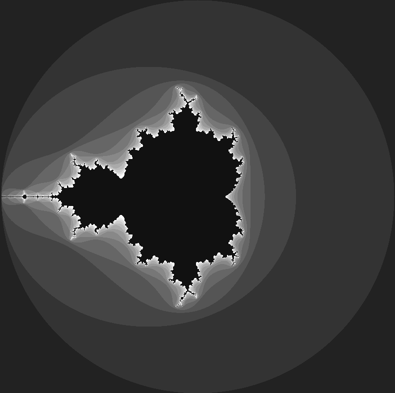

Project parked. Outstanding issues tagged as wontfix and closed.

----

Inspired by a Mathologer video on
[YouTube](https://www.youtube.com/watch?v=9gk_8mQuerg). See [large
image](images/buddhabrot.png).


### Mandelbrot
A traditional Mandelbrot can be displayed by setting the follow variable in
mandelbrot.js.

```
const mandy = true
```


