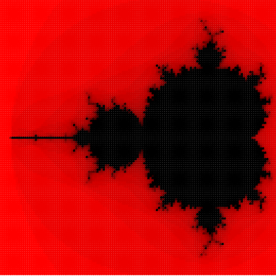

See Mathologer on [YouTube](https://www.youtube.com/watch?v=9gk_8mQuerg) for Mandelbrot info.


See [large version](buddhabrot.png).

### Mandelbrot
A traditional Mandelbrot can be displayed by setting the follow variable in
mandelbrot.js.

```
const mandy = true
```


